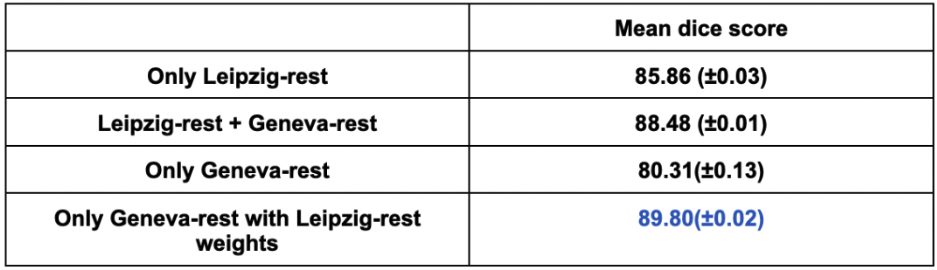

# Rohan Banerjee

## About me

Hello everyone, I am Rohan Banerjee, a first year Master's student at the NeuroPoly Lab, Polytechnique Montreal working under the guidance of Dr. Julien Cohen-Adad and Dr. Benjamin De Leener. My work revolves around developing automatic segmentation methods for various anantomies like spinal cord (SC), cerebrospinal fluid (CSF) etc. in SC MRI images especially fMRI and developing a SC template generation pipleline.

<a 
href="https://github.com/rohanbanerjee">
   
    <b>Rohan Banerjee</b>
</a>

## Project Summary

Functional magnetic resonance imaging (fMRI) of the spinal cord is relevant for studying sensation, movement, and autonomic function. Data processing involves segmenting the spinal cord on axial gradient-echo echo-planar imaging (EPI) data. However, this task can be arduous due to the inherent limitations of the data, including low spatial resolution, susceptibility artifacts, ghosting, and motion-related distortions. For example, 

  

These limitations make it challenging to accurately delineate the boundaries of the spinal cord. Consequently, this particular segmentation task demands considerable manual effort, consumes a significant amount of time, and is prone to inconsistencies between different observers and even within a single observer. To address these challenges, I propose an automatic approach that leverages deep learning techniques for the automatic segmentation of spinal cords in fMRI gradient echo EPI data. The proposed model is trained on data collected from multiple sites, enabling it to learn and generalize from a diverse range of inputs. By incorporating this broader range of data, we aim to enhance the robustness and adaptability of our method. 

## Objectives

Develop an automated spinal cord segmentation method which has a special focus for fMRI data. This objective consists of the following sub-objectives:
* SO1: Collect and process fMRI data from different sites across the world.
* SO2: Design an automated segmentation method which uses this large-scale data and is generalizable for out-of-distribution data.
* SO3: Validate the segmentation results by using it for other methods like motion correction, spinal cord normalisation.
* SO4: Package and integrate this method as a part of the spinal cord toolbox (SCT) for the research community to use it out-of-the-box.

## Data
The dataset contains fMRI EPI spinal cord images along with manual segmentation in the BIDS data format. The images look like the below:

  

The data is being scanned from multiple sites across the world. For this project, I will be using the data from:
* Max Plank Institute, Leipzig, Germany (a subset of the dataset can be found here --> [Dataset subset](https://github.com/sct-pipeline/fmri-segmentation/tree/main/data_leipzig_rest))
* École Polytechnique Fédérale de Lausanne, Geneva, Switzerland

This dataset will be soon open-sourced to Openneuro for researchers to use.

## Tools

* Git and Github --> Version control
* Python --> For programming the automated segmented method
* PyTorch --> Deep learning framework used for the method
* [deepseg_sc](https://spinalcordtoolbox.com/user_section/command-line.html?highlight=deepseg#sct-deepseg-sc) --> Baseline from Spinal Cord Toolbox for comaprison
* [ivadomed](https://github.com/ivadomed) --> Deep learning framework used as a mthod for comparison
* [nnUNetv2](https://github.com/MIC-DKFZ/nnUNet) --> Deep learning framework used as a mthod for comparison
* [Segment Anythong Model (SAM)](https://segment-anything.com/) --> Deep learning framework used as a mthod for comparison

## Methods overview

The above mentioned sub-objectives will be achieved by using the following steps:

* For SO1, send across a call for submission of spinal cord fMRI data across labs with data acquisition protocols and data arrangement using BIDS format. This data will be open-sourced.
* For SO2, use the current SOTA algorithms for the spinal cord segmentation and set baselines to compare our results with. Post this step, train different 2D deep learning models with the fMRI data and run experiments in order to validate our results.
* For SO3, once I have a confident method developed for the segmentation, we will use these segmentations to carry out different scientific procedures like motion correction and spinal cord normalisation which are generally carried out by clinicians if they have the segmentations to verify our contribution.
* For SO4, I will package and integrate the model into SCT from where this method can be used by a single command on the command line. 

<!-- 1. <b>ivadomed</b>

For using the ivadomed framework, I used a 2D UNet model from the available architectures [here](https://ivadomed.org/tutorials/one_class_segmentation_2d_unet.html?highlight=2D%20U-Net).  -->

## Results 

# 1. ivadomed
* I trained a 2D UNet using the ivadoimed framework.
* I trained separate models using the datasets and then ran some experiments to use the data together and run some experiments.
   * <b>Experiment 1</b>: In this experiment, I trained a 2D UNet model using *only the Leipzig data* from scratch. Training from scratch here means that the weights of the deep learning model were randomly initialized.
   * <b>Experiment 2</b>: In this experiment, I trained a 2D UNet model using *Leipzig data and the Geneva data* together from scratch. Training from scratch here means that the weights of the deep learning model were randomly initialized.
   * <b>Experiment 3</b>L In this experiment, I trained a 2D UNet model using *only Geneva data* and *Geneva data with weights initialized from the only Leipzig data model*

The violin plots below show the dice score distributions of the different experiments mentioned above.

  

  

The overall results look like the below:

  

# 2. nnUNetv2
* The nnUNet was trained for 1000 epochs using a 5-fold cross validation paradigm using the Leipzing and Geneva datasets.
* The final results reported are using the ensemble of the five different models trained for the five-fold cross validation.
* The final testing dice score is: <b>0.91 (±0.02)</b>

Qualitative results look like the below:
* The yellow masks show the ground truth and the red masks show the predictions

{ width="800" height="600" style="display: block; margin: 0 auto" }

It is also works well on images with ghosting artifacts

# 3. SAM
* The Segment Anything Model (SAM) is a really large segmentation model (a.k.a. Foundational model) which is trained on 11M images and 1B masks by Meta AI
* “SAM has learned a general notion of what objects are, and it can generate masks for any object in any image or any video, even including objects and image types that it had not encountered during training.” - Meta AI claims.
* Even though not true, this model does have a lot of information and can be easily fine-tuned for specific needs such as mine – Spinal Cord Segmentation.
* Only 80 subjects used for now (curse of dimensionality – need more data)

  

Overall results:

  

## Reproducibility

# 1. nnUNetv2
The scrips folder contains a [pipline.md](/scripts/pipeline.md) which contains all the steps to reproduce the results received from the nnUNetv2 framework.

# 2. SAM
The code has been inspired by the MedSAM respository [here](https://github.com/bowang-lab/MedSAM)
* The dataset which is in BIDS data format has to be converted into the the Medical Segmentation Decathlon dataset format using the [script](scripts/pre_MR-2.py).
* After the dataset has been transformed, this [jupyter notebook](scripts/finetune_and_inference_tutorial_3D_dataset.ipynb) has to be used for the fine-tuning.

I highly recommend checking the original repository for in-depth steps.

(ivadomed framework development has been currently stalled and I have not mentioned the steps for the ivadomed results reproducibility steps therefore.)

## Conclusion

* We now have a proof of concept for segmentation of spinal cord in EPI data.
* We see an improvement in performance with increase in model size.
* Specifically for SAM, I would say that 80 subjects is too less to see a considerable increase in performance but as my next step, I am using the fMRI data + spine generic data for the fine-tuning to overcome the curse of dimensionality problem and hope to see a significant increase in the performance.

## Acknowledgements

I would like to thank Professor Eva Alonso Ortiz for her step-by-step guidance and feedback on the project and the presentation. I would also like to thank the TAs Jan Valošek and Andjela Dimitrijevic for their continuous support, help and evaluations during the course of the BrainHack School. I would also like to help the BrainHack School organisers for such a well designed course!

## References

* Gorgolewski, K., Auer, T., Calhoun, V. et al. The brain imaging data structure, a format for organising and describing outputs of neuroimaging experiments. Sci Data 3, 160044 (2016). 
* [ivadomed](https://ivadomed.org/index.html)
* [nnUNetv2](https://github.com/MIC-DKFZ/nnUNet)
* [Segment Anything Model](https://github.com/facebookresearch/segment-anything)
* Gros C, De Leener B, Badji A, Maranzano J, Eden D, Dupont SM, Talbott J, Zhuoqing R, Liu Y, Granberg T, Ouellette R, Tachibana Y, Hori M, Kamiya K, Chougar L, Stawiarz L, Hillert J, BannierE, Kerbrat A, Edan G, Labauge P, Callot V, Pelletier J, Audoin B, Rasoi Andrianina H, Brisset JC, Valsasina P, Rocca MA, Filippi M, Bakshi R, Tauhid S, Prados F, Yiannakas M, Kearney H, Ciccarelli O, Smith S, Treaba CA, Mainero C, Lefeuvre J, Reich DS, Nair G, Auclair V, McLaren DG, Martin AR, Fehlings MG, Vahdat S, Khatibi A, Doyon J, Shepherd T, Charlson E, Narayanan S, Cohen-Adad J. Automatic segmentation of the spinal cord and intramedullary multiple sclerosis lesions with convolutional neural networks. Neuroimage. 2019 
* De Leener B, Kadoury S, Cohen-Adad J. Robust, accurate and fast automatic segmentation of the spinal cord. Neuroimage. 2014 Sep;98:528i-36. doi: 10.1016/j.neuroimage.2014.04.051. PMID: 24780696, 2014
* Benjamin De Leener, Simon Lévy, Sara M. Dupont, Vladimir SAFonov, Nikola Stikov, D. Louis Collins, Virginie Callot, Julien Cohen-Adad, SCT: Spinal Cord Toolbox, an open-source software for processing spinal cord MRI data, NeuroImage, Volume 145, Part A, Pages 24-43, ISSN 1053-8119, 2017
* [MedSAM](https://github.com/bowang-lab/MedSAM)